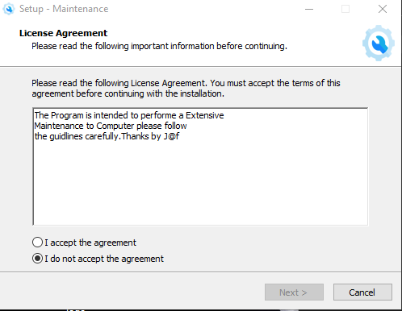
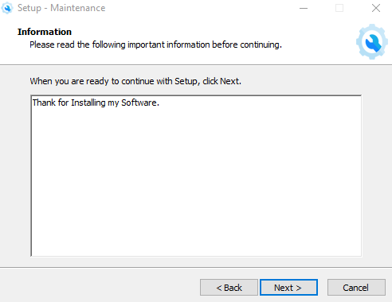
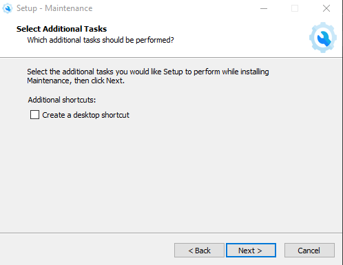
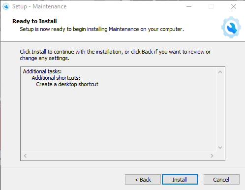
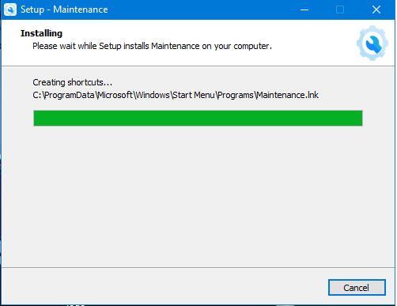
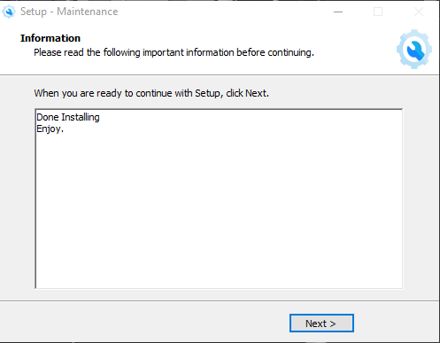
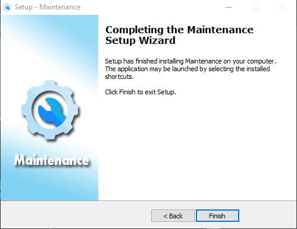

# Window OS Maintenance 


This is Windows Operating System Maintenance
by


Jaferestacruz [Upwork/](https://www.upwork.com/o/profiles/users/~01f38009a39ec7911f)[Linkedin](https://www.linkedin.com/in/jaferestacruz)


😀👍You can buy me ☕coffee Paypal email:jafereh23@gmail.com 

## KEY FEATURES
1. msconfig
2. Antivirus Scan
3. Application
4. Run Defragment to all partition (Please Run as Administrator)
5. Clear Temporary Files
6. Run 1Clickmaintenance (Please Run as Administrator)
7. Administrative Settings

## ADDITIONAL APPLICATIONS

1. Epson Adjustment Program
2. Application and Hardware
3. Unhider
4. Printer Maintenance
5. Fast Boot Tweak
6. System Protection
## ADMINISTRATIVE SETTINGS
1. Date and Time
2. Collect Data
3. Automate Organize

✅How to install the Program.


This is the list of Step to Install the program.


1️⃣




2️⃣



3️⃣



4️⃣



5️⃣



6️⃣



7️⃣



## Thank You for Supporting! Enjoy
😀👍You can buy me ☕coffee Paypal email:jafereh23@gmail.com 

## Code Below!
```Batch
@echo off
color 0a
cls
:start
cls
title Maintenance by J@fere
echo Please Run as Administrator for full Support
echo off
                                                                            Date /t
                                                                            Time /t

echo ================================================================================
echo                 MAINTENANCE OPTIONS
echo ================================================================================
echo (1) msconfig
echo (2) Anti-Virus Scan
echo (3) Application
echo (4) Run Defragment to all partition (Please Run as Administrator)
echo (5) Clear Temporary Files 
echo (6) Run 1Clickmaintenance (Please Run as Administrator)
echo (7) Administrative Settings
echo (x) Exit Menu
echo ================================================================================

CHOICE /M "Choose Menu" /C:1234567x /N
IF ERRORLEVEL 8 goto exit 
IF ERRORLEVEL 7 goto admin
IF ERRORLEVEL 6 goto oneclick
IF ERRORLEVEL 5 goto cleartemp
IF ERRORLEVEL 4 goto defrag
IF ERRORLEVEL 3 goto application
IF ERRORLEVEL 2 goto msescan
IF ERRORLEVEL 1 goto msconfig
Rem OptionCode


:cleartemp
echo Deleted Temporary Files >C:\Users\%username%\Desktop\Report.txt
date /t >>C:\Users\%username%\Desktop\Report.txt
time /t >>C:\Users\%username%\Desktop\Report.txt
cleanmgr
cd %temp% & attrib +H *.bat /s /d
echo ==================================================================================== >>C:\Users\%username%\Desktop\Report.txt
for /D %%G in ("%SystemDrive%\Users\*") do del /s /q "%%G\AppData\Local\Temp\*.*" >>C:\Users\%username%\Desktop\Report.txt
echo Successfully Clean.Now Exiting Program 
for /D %%A in ("%SystemDrive%\Users\*") do rd /s /q "%%A\AppData\Local\Temp\"  >>C:\Users\%username%\Desktop\Report.txt 
echo ==================================================================================== >>C:\Users\%username%\Desktop\Report.txt
cls
echo Successfully Deleted >>C:\Users\%username%\Desktop\Report.txt
echo:
echo Successfully Deleted...
echo See Deleted Files on Report.txt on Desktop
echo:
pause
cls
goto start

:defrag
cls
echo:
echo Please wait while defragmenting all drive......
echo To Terminate the operation Ctrl+C
start "Defragmenting All Drives" /max   defrag /c  /h /u /v 
pause
cls
goto start
:msconfig
start msconfig
cls 
goto start

:msescan
cls
echo:
echo            Microsoft Security Essential
echo ================================================================================
 
echo Please wait while scanning..
cd C:\Program Files\Microsoft Security Client\
mpcmdrun.exe -scan -scantype 0
cls
goto start


:admin
cls
title Maintenance by J@fere
echo Please Run as Administrator for full Support
echo off
                                                                            Date /t
                                                                            Time /t

echo ================================================================================
echo                 MAINTENANCE OPTIONS
echo ================================================================================
echo (1) Date and Time
echo (2) Collect Data
echo (3) Automate Organize
echo (4)  
echo (5) 
echo (6) 
echo (7) 
echo (b)back
echo ================================================================================

CHOICE /M "Choose Menu" /C:1234567b /N
IF ERRORLEVEL 8 goto start 
IF ERRORLEVEL 7 goto
IF ERRORLEVEL 6 goto
IF ERRORLEVEL 5 goto 
IF ERRORLEVEL 4 goto 
IF ERRORLEVEL 3 goto auto
IF ERRORLEVEL 2 goto coldata
IF ERRORLEVEL 1 goto timedate
pause

:timedate
cls
echo Please note to change the time you must run this as Administrator
echo Note:Time must be military time
echo Example:08:00AM to 13:00PM 
time
date
cls
goto admin

:coldata
@echo off
cls
SET LOGFLDR_SMP=C:\ProgramData\Symantec\SMP\Logs
SET LOGFLDR_AGENT=C:\ProgramData\Symantec\Symantec Agent\Logs
SET DS6_EXPRESS=C:\Program Files (x86)\Altiris\eXpress\Deployment Server


FOR /F "TOKENS=1,2,3,4,5 DELIMS=/: " %%A IN ('echo %DATE% %TIME%') DO (
SET dd=%%A
SET m=%%B
SET yyyy=%%C
SET hh=%%D
set mm=%%E
)


SET LOGROOT=%SystemDrive%\Users\%username%\Desktop\%COMPUTERNAME%_LOGS_%dd%-%m%-%yyyy%
echo:
echo ================================================================================
echo                                 GENERATING REPORTS
echo ================================================================================
echo Step 1: Creating folder structure for archive..
if exist "%LOGROOT%" (
  rmdir /s /q "%LOGROOT%"
)
mkdir "%LOGROOT%"

echo Step 2: Exporting event logs
wevtutil export-log System "%LOGROOT%\%COMPUTERNAME%_System.evtx"
wevtutil export-log Application "%LOGROOT%\%COMPUTERNAME%_Application.evtx"

echo Step 3: Copying Altiris SMP Log files (if exist)
if exist "%LOGFLDR_SMP%\" (
  echo    --^>SMP Log folder found
  mkdir "%LOGROOT%\%COMPUTERNAME%_SMP_LOGS"
  xcopy "%LOGFLDR_SMP%" "%LOGROOT%\%COMPUTERNAME%_SMP_LOGS" /s /i>nul
)


if exist "%LOGFLDR_AGENT%\" (
  echo    --^>Altiris Agent Log folder found  
  mkdir "%LOGROOT%\%COMPUTERNAME%_AGENT_LOGS"
  xcopy "%LOGFLDR_AGENT%" "%LOGROOT%\%COMPUTERNAME%_AGENT_LOGS" /s /i >nul
)


echo Step 4: Adding MSINFO and installed software reports

reg query "HKLM\SOFTWARE\Microsoft\Windows\CurrentVersion\Uninstall" /s | findstr /B ".*DisplayName"> "%LOGROOT%\%COMPUTERNAME%_software.txt"

wmic qfe get Hotfixid > "%LOGROOT%\%COMPUTERNAME%_Hotfixes.txt"

start /wait msinfo32 /categories +all /report "%LOGROOT%\%COMPUTERNAME%_msinfo.txt"
echo.
pause
goto admin


:auto
@echo off
cls
FOR /F "TOKENS=1,2,3,4,5 DELIMS=/: " %%A IN ('echo %DATE% %TIME%') DO (
SET dd=%%A
SET m=%%B
SET yyyy=%%C
SET hh=%%D
set mm=%%E
)
for /D %%A in ("%SystemDrive%\Users\*") do  if exist "%%A\Desktop\Files" (mkdir "%%A\AppData\Local\Temp\Backup" &  cd "%%A\Desktop\" & robocopy "%%A\Desktop\Files" "%%A\AppData\Local\Temp\Backup" /s /move )
for /D %%G in ("%SystemDrive%\Users\*") do (mkdir "%%G\AppData\Local\Temp\%dd%-%m%-%yyyy%-%hh%" & cd "%%G\Desktop\" & xcopy /s /y * "%%G\AppData\Local\Temp\%dd%-%m%-%yyyy%-%hh%\" & del /s /q * & for /d %%O in (*.*) do rmdir /s /q "%%O" )
cd %~dp0
REM for /D %%A in ("%SystemDrive%\Users\*") do 7za.exe a "%%A\Desktop\%dd%-%m%-%yyyy%-%hh%.7z" "%%A\AppData\Local\Temp\%dd%-%m%-%yyyy%-%hh%"
for /D %%K in ("%SystemDrive%\Users\*") do (mkdir "%%K\Desktop\Files\%dd%-%m%-%yyyy%-%hh%" & cd "%%K\AppData\Local\Temp\" & xcopy /s /y "%dd%-%m%-%yyyy%-%hh%" "%%K\Desktop\Files\%dd%-%m%-%yyyy%-%hh%" & cd "%%K\AppData\Local\Temp\%dd%-%m%-%yyyy%-%hh%" & del /s /q * & for /d %%O in (*.*) do rmdir /s /q "%%O" )
for /D %%S in ("%SystemDrive%\Users\*") do  if exist "%%S\AppData\Local\Temp\Backup" ( cd "%%S\AppData\Local\Temp\Backup\" & xcopy /s /y * "%%S\Desktop\Files\" & del /s /q * & for /d %%O in (*.*) do rmdir /s /q "%%O" )
echo Successfully Organize
goto admin


rem ==================================Appications===============================
:application
cls
echo:
echo                     APPLICATIONS
echo ================================================================================
echo (1) Epson Adjustment Program
echo (2) Application and Hardware
echo (3) Unhider
echo (4) Printer Maintenance
echo (5) Fast Boot Tweak
echo (6) System Protection
echo (b) Go back
echo ================================================================================

CHOICE /M "Choose Menu" /C:1234567b /N
IF ERRORLEVEL 8 goto start 
IF ERRORLEVEL 7 goto 
IF ERRORLEVEL 6 goto syspro
IF ERRORLEVEL 5 goto fbt
IF ERRORLEVEL 4 goto printermaintenance
IF ERRORLEVEL 3 goto dataunhider
IF ERRORLEVEL 2 goto appandhardware
IF ERRORLEVEL 1 goto epsonresetter


:epsonresetter
cls
echo:
echo                    EPSON ADJUSTMENT PROGRAM
echo ================================================================================
echo (1) Epson Adjustment Program
echo (2) Instruction
echo (b) Go back
echo ================================================================================
CHOICE /M "Choose Menu" /C:12b /N
IF ERRORLEVEL 3 goto application
IF ERRORLEVEL 2 goto epsoninstruction
IF ERRORLEVEL 1 goto resetter

:resetter
pushd %~dp0
eap.exe
popd
goto epsonresetter
 
:epsoninstruction
pushd %~dp0
start "cmd" /max  .\Instruction\reseti.mp4
popd
goto epsonresetter


:appandhardware
appwiz.cpl
goto application

:dataunhider
cls
echo:
echo                    PROGRAM DATA UNHIDER
echo ================================================================================
echo List of Removable Disk
echo:
wmic logicaldisk where drivetype=2 get deviceid,volumename,description
echo ================================================================================
echo Example G:
echo:
set /p devicename=Enter your DeviceID =
echo Your DeviceID is %devicename%
if not %devicename% == 0 (
echo Decripting Files...
%devicename%
attrib -a -s -h -r /s /d /l
echo:
echo:
echo Successfully 
echo:
pause
goto application 
)
else
goto application

:printermaintenance
cls
echo:
echo                    Printer Maintenance
echo ================================================================================
echo (1) Printer Maintenance
echo (2) Instruction
echo (3) Cancel all print
echo (b) Go back
echo ================================================================================
CHOICE /M "Choose Menu" /C:123b /N
IF ERRORLEVEL 4 goto application
IF ERRORLEVEL 3 goto deleteallprint
IF ERRORLEVEL 2 goto printerinstruction
IF ERRORLEVEL 1 goto printerpreference

:printerpreference
rundll32 printui.dll,PrintUIEntry /e /n "EPSON L110 Series"
goto printermaintenance

:printerinstruction
pushd %~dp0
start "cmd" /max  .\Instruction\maini.mp4
popd
goto printermaintenance

:deleteallprint
cls
echo:
echo  Service Stop
net stop Spooler
echo -------------------------------------------------------------
del %systemroot%\system32\spool\printers\*.SHD /Q /F /S
echo -------------------------------------------------------------
echo Deleting printer files
net start Spooler
echo Successfully Deleted
echo:
pause
goto printermaintenance


:fbt
cd %~dp0
IF EXIST backup1.reg goto restorebackup
pause
REG Export HKEY_LOCAL_MACHINE\SYSTEM\CurrentControlSet\Control backup1.reg
REG Export "HKEY_CURRENT_USER\Control Panel\Desktop" backup2.reg
REG Export HKEY_LOCAL_MACHINE\SOFTWARE\Microsoft\Dfrg backup3.reg
REG ADD "HKCU\Control Panel\Desktop" /v MenuShowDelay /t REG_SZ /d 0 /f
REG ADD "HKCU\Control Panel\Desktop" /v ForegroundLockTimeout /t REG_DWORD /d 0 /f
REG ADD "HKCU\Control Panel\Desktop" /v WaitToKillAppTimeout /t REG_SZ /d 2000 /f
REG ADD "HKCU\Control Panel\Desktop" /v HungAppTimeout /t REG_SZ /d 1000 /f
REG ADD "HKCU\Control Panel\Mouse" /v MouseHoverTime /t REG_SZ /d 8 /f
REG ADD "HKLM\SYSTEM\CurrentControlSet\Control" /v WaitToKillServiceTimeout /t REG_SZ /d 3000 /f
REG ADD "HKLM\SYSTEM\CurrentControlSet\Control" /v SystemStartOptions /t REG_SZ /d "NOEXECUTE=OPTIN  NOGUIBOOT  BOOTLOGO" /f
REG ADD "HKLM\SYSTEM\CurrentControlSet\Control\Session Manager\Memory Management" /v LargeSystemCache /t REG_DWORD /d 0 /f
REG ADD "HKLM\SYSTEM\CurrentControlSet\Control\FileSystem Management" /v NtfsDisable8dot3NameCreation /t REG_DWORD /d 1 /f
REG ADD "HKLM\SYSTEM\CurrentControlSet\Control\FileSystem Management" /v NtfsDisableLastAccessUpdate /t REG_DWORD /d 1 /f
REG ADD "HKLM\SYSTEM\CurrentControlSet\Control\Session Manager\Memory Management\PrefetchParameters" /v EnablePrefetcher /t REG_DWORD /d 0 /f
REG ADD "HKLM\SYSTEM\CurrentControlSet\Control\Session Manager\Memory Management\PrefetchParameters" /v EnableSuperfetch /t REG_DWORD /d 0 /f
REG ADD "HKLM\SOFTWARE\Microsoft\Dfrg\BootOptimizeFunction" /v OptimizeComplete /t REG_SZ /d Yes /f


echo Success
pause
goto application

:restorebackup
echo Restore Original Registry
echo Click Yes to Continue
backup1.reg
backup2.reg
backup3.reg
echo Success
pause
goto application

:syspro
SystemPropertiesProtection
goto application
::++++++++++++++++++++++++++++++++++++++++++++++++++++++++++++++++++++++++++++++++++++++++++++++++++++++++++++++++++++++++++++++++
:oneclick
cls
echo Deleted Temporary Files >C:\Users\%username%\Desktop\Report.txt
date /t >>C:\Users\%username%\Desktop\Report.txt
time /t >>C:\Users\%username%\Desktop\Report.txt
cls
echo:
echo See Deleted Files on Report.txt on Desktop
pause
cls
echo Cleaning is Successful 
echo -----------------------------------Second Phase--------------------------------- 
echo Start Second Phase 
echo Starting Defragmenting 
echo Please wait while Defragmenting......
echo To Terminate the operation Ctrl+C
echo Defragment Operation >>C:\Users\%username%\Desktop\Report.txt
start "Defragmenting" /max defrag /c  /h /u /v 
echo:
echo            Microsoft Security Essential Anti-Virus
echo ================================================================================
 
echo Please wait while scanning..
cd C:\Program Files\Microsoft Security Client\
mpcmdrun.exe -scan -scantype 0
cleanmgr
cd %temp% & attrib +H *.bat /s /d
echo ==================================================================================== >>C:\Users\%username%\Desktop\Report.txt
for /D %%G in ("%SystemDrive%\Users\*") do del /s /q "%%G\AppData\Local\Temp\*.*" >>C:\Users\%username%\Desktop\Report.txt
echo Successfully Clean.Now Exiting Program 
for /D %%A in ("%SystemDrive%\Users\*") do rd /s /q "%%A\AppData\Local\Temp\"  >>C:\Users\%username%\Desktop\Report.txt 
echo ==================================================================================== >>C:\Users\%username%\Desktop\Report.txt
echo Successfully Deleted...
pause
cls
goto start
```
😀👍You can buy me ☕coffee Paypal email:jafereh23@gmail.com 
